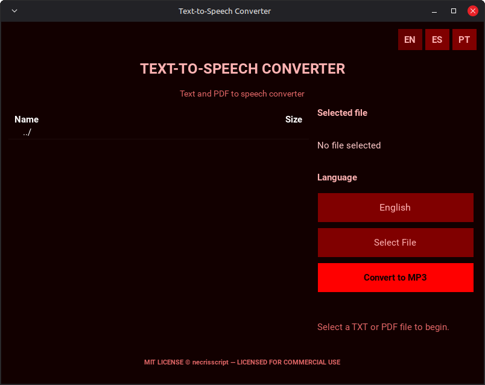

# Text-to-Speech Converter

A simple desktop application for converting `.txt` and `.pdf` files to MP3 using Google Text-to-Speech.



## 🚀 Features

* Convert `.txt` files to MP3
* Convert `.pdf` files to MP3
* Multiple language support
* Dark-themed interface
* Background conversion to keep the interface responsive
* Linux AppImage distribution

## 📦 Installation

### AppImage

Download the latest AppImage from the Releases page.

Make it executable:

```bash
chmod +x Text_To_Speech_Converter-x86_64.AppImage

```

Run the application:

```bash
./Text_To_Speech_Converter-x86_64.AppImage

```

## 🛠️ Development

Clone the repository:

```bash
git clone https://github.com/necrisscript/text-to-speech-converter.git
cd text-to-speech-converter

```

Create and activate a virtual environment:

```bash
python3 -m venv .venv
source .venv/bin/activate

```

Install the dependencies:

```bash
pip install -r requirements.txt

```

Run the application:

```bash
python main.py

```

## 🔨 Build

The project uses PyInstaller to create the Linux executable and linuxdeploy to package it as an AppImage.

Build the executable:

```bash
pyinstaller --clean text_to_speech_converter.spec

```

The executable will be generated in:

```bash
dist/text-to-speech-converter

```

The resulting AppImage can then be generated using linuxdeploy.

## ⚠️ Notes

This application uses Google Text-to-Speech and requires an active Internet connection for text-to-speech conversion.

Supported input formats:

* `.txt`
* `.pdf`

## 📄 License

This project is licensed under the MIT License — see the LICENSE file for details.
